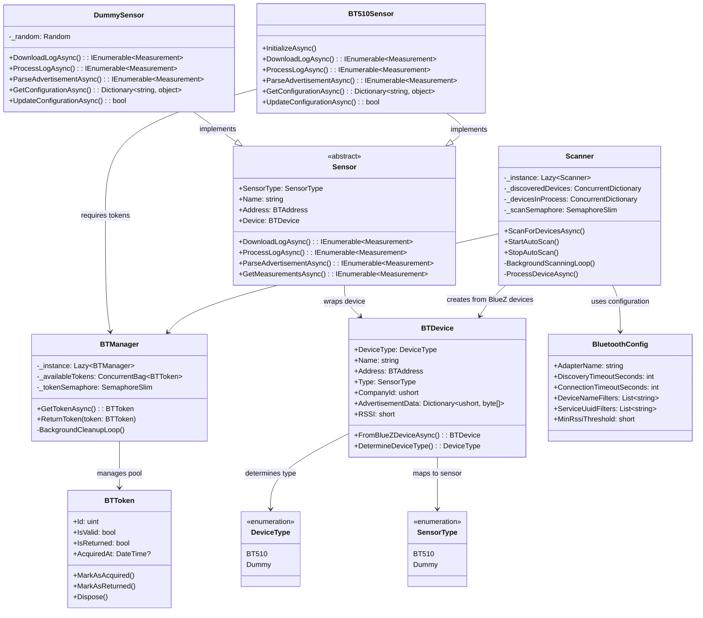

# Sensor Gateway

A Linux Bluetooth Low Energy (BLE) sensor gateway for acquiring sensor data from BLE-enabled sensors. The gateway supports multiple sensor types and implements efficient data collection strategies to minimize battery drain on sensor devices.

## Overview

The Sensor Gateway is designed to continuously scan for BLE sensors, collect measurement data, and forward it to configured endpoints. It supports both advertisement-based data collection (passive) and active connection-based log downloading, with intelligent scheduling to minimize battery impact on sensor devices.

## Key Features

- **Multi-Sensor Support**: Extensible architecture supporting various sensor types (BT510, dummy sensors for testing)
- **Dual Data Collection**: 
  - Advertisement data parsing (passive, battery-efficient)
  - Active log downloading via BLE connections when needed
- **Intelligent Scheduling**: Devices are marked after processing to prevent unnecessary reconnections
- **Bluetooth Stack Protection**: Token-based RAII system to prevent overwhelming the Bluetooth stack
- **Background Scanning**: Continuous scanning thread with configurable intervals and device filters
- **Worker Process Architecture**: Each discovered device spawns an independent worker process

## Architecture

### Core Components

#### Scanner ([`Scanner`](src/scanner.cs))
- Singleton device scanner that continuously scans for BLE devices
- Manages automatic and manual scanning operations
- Spawns worker processes for discovered devices
- Thread-safe device tracking to prevent duplicate processing

#### Bluetooth Manager ([`BTManager`](src/bt/btmanager.cs))
- Token-based resource management system
- Prevents Bluetooth stack overload through controlled concurrency
- RAII implementation ensures proper resource cleanup

#### Device Abstraction ([`BTDevice`](src/bt/btdevice.cs))
- Unified interface for different BLE device types
- Handles device property extraction and manufacturer data processing
- Supports both BT510 sensors and dummy devices for testing

#### Sensor Framework
- **Base Sensor Class** ([`Sensor`](src/sensor/sensor.cs)): Abstract base providing common sensor functionality
- **BT510 Sensor** ([`BT510Sensor`](src/sensor/sensor_bt510.cs)): JSON-RPC communication with BT510 devices
- **Dummy Sensor** ([`DummySensor`](src/sensor/sensor_dummy.cs)): Testing and development sensor implementation

## Object Diagram



## Data Flow

1. **Scanner Thread**: Continuously scans for BLE devices matching configured name prefixes
2. **Device Discovery**: When a matching device is found, check if it needs processing
3. **Worker Spawning**: Spawn independent worker process for each device requiring processing
4. **Advertisement Processing**: Parse advertisement data for immediate sensor readings
5. **Log Processing Decision**: Determine if device log download is required
6. **Token Acquisition**: Acquire Bluetooth token for active connections
7. **Device Connection**: Connect to sensor and download log data
8. **Data Processing**: Convert raw data to structured measurements
9. **Data Forwarding**: Send processed data to configured endpoints
10. **Device Marking**: Mark device as processed to prevent immediate re-processing

## Token Usage Policy

The Bluetooth token system ensures controlled access to the Bluetooth stack:

- **Advertisement Processing**: No token required (local data parsing)
- **Log Download/Processing**: Token required (active BT communication)
- **Configuration Operations**: Token required (active BT communication)
- **Mixed Operations**: Token required if any component needs active communication

## Configuration

Configuration is managed through the [`BluetoothConfig`](src/config/config_bluetooth.cs) class:

```csharp
public class BluetoothConfig
{
    public string AdapterName { get; set; } = "";
    public int DiscoveryTimeoutSeconds { get; set; } = 10;
    public int ConnectionTimeoutSeconds { get; set; } = 30;
    public List<string> DeviceNameFilters { get; set; } = { "DTT-", "BT510-" };
    public List<string> ServiceUuidFilters { get; set; } = { "569a1101-b87f-490c-92cb-11ba5ea5167c" };
    public short MinRssiThreshold { get; set; } = -90;
}
```

## Supported Sensor Types

### BT510 Sensors
- **Manufacturer**: Laird Connectivity
- **Communication**: JSON-RPC over BLE
- **Features**: Temperature logging, configurable sampling rates
- **Company ID**: 0x0077

### Dummy Sensors
- **Purpose**: Testing and development
- **Features**: Simulated temperature data, no hardware required
- **Company ID**: 0x0000

## Building and Running

**Target Platform**: Linux (requires BlueZ Bluetooth stack)

```bash
# Build the project
dotnet build

# Run the application
dotnet run
```

## Dependencies

- .NET 8.0
- HashtagChris.DotNetBlueZ (Linux Bluetooth LE support)
- System.Threading.Tasks
- System.Collections.Concurrent

## Project Structure

```
src/
├── bt/                 # Bluetooth abstraction layer
│   ├── btdevice.cs    # Device abstraction
│   └── btmanager.cs   # Resource management
├── sensor/            # Sensor implementations
│   ├── sensor.cs      # Base sensor class
│   ├── sensor_bt510.cs # BT510 implementation
│   └── sensor_dummy.cs # Dummy implementation
├── config/            # Configuration management
│   └── config_bluetooth.cs
├── scanner.cs         # Device scanning logic
├── measurement.cs     # Data structures
└── Program.cs         # Application entry point
```

## Future Enhancements

- MQTT data forwarding
- REST API endpoints
- Database persistence
- Web-based configuration interface
- Additional sensor type support
- Real-time monitoring dashboard

## License

This project is licensed under the terms specified in the [`LICENSE`](LICENSE)
