# Sensor Gateway

A Linux Bluetooth Low Energy (BLE) sensor gateway for acquiring sensor data from BLE-enabled sensors. The gateway supports multiple sensor types and implements efficient data collection strategies to minimize battery drain on sensor devices.

## Overview

The Sensor Gateway is designed to continuously scan for BLE sensors, collect measurement data, and forward it to configured endpoints. It supports both advertisement-based data collection (passive) and active connection-based log downloading, with intelligent scheduling to minimize battery impact on sensor devices.

## Key Features

- **Multi-Sensor Support**: Extensible architecture supporting various sensor types (BT510, dummy sensors for testing)
- **Dual Data Collection**: 
  - Advertisement data parsing (passive, battery-efficient)
  - Active log downloading via BLE connections when needed
- **Thread-Safe Operations**: All communication methods use SemaphoreSlim for thread safety
- **Dual API Design**: Every async method has a synchronous counterpart for compatibility
- **Robust Connection Management**: Token-based RAII system with automatic retry logic (3 attempts)
- **Intelligent Scheduling**: Devices are marked after processing to prevent unnecessary reconnections
- **Bluetooth Stack Protection**: Token-based RAII system to prevent overwhelming the Bluetooth stack
- **Background Scanning**: Continuous scanning thread with configurable intervals and device filters
- **Worker Process Architecture**: Each discovered device spawns an independent worker process
- **Autonomous Bluetooth Agent**: Singleton background agent for automatic pairing and authentication
- **Advanced Memory Pooling**: High-performance memory management for large sensor data processing
- **Configurable Authentication**: Dependency injection for PIN/passphrase handlers with fixed PIN support
- **D-Bus Integration**: System-level Bluetooth agent with auto re-registration capability
- **Comprehensive Error Handling**: Detailed validation and meaningful exception messages
- **Resource Management**: Proper cleanup and disposal patterns with automatic connection timeouts

## Architecture

### Core Components

#### Scanner ([`Scanner`](src/scanner/scanner.cs))
- Singleton device scanner that continuously scans for BLE devices
- Manages automatic and manual scanning operations
- Spawns worker processes for discovered devices
- Thread-safe device tracking to prevent duplicate processing

#### Bluetooth Manager ([`BTManager`](src/bt/BTManager.cs))
- Token-based resource management system
- Prevents Bluetooth stack overload through controlled concurrency
- RAII implementation ensures proper resource cleanup

#### Bluetooth Agent ([`BluetoothAgent`](src/agent/Agent.cs))
- **Singleton Pattern**: Ensures only one agent instance system-wide
- **Background Thread**: Continuously monitors and maintains agent registration
- **D-Bus Integration**: Registers with BlueZ as system authentication agent
- **Auto Re-registration**: Detects external unregistration and automatically re-registers
- **Dependency Injection**: Pluggable authentication handlers for flexible PIN/passphrase management
- **Event System**: Notifies of registration status changes
- **Thread-Safe**: Proper synchronization throughout all operations

##### Agent Features
- **Fixed PIN Authentication**: Configurable PIN code for all device pairings
- **Auto-Authorization**: Optional automatic device and service authorization
- **Capability Management**: Supports various agent capabilities (KeyboardDisplay, DisplayOnly, etc.)
- **Error Recovery**: Automatic recovery from agent conflicts or system errors
- **Configuration-Driven**: All behavior controlled via configuration files

#### Device Abstraction

The BTDevice implements a clean, maintainable, and testable architecture through specialized components:

- **Main Device Class** ([`BTDevice`](src/bt/BTDevice.cs)): Core orchestrator that composes specialized components
- **Memory Pool** ([`BTMemoryPool`](src/bt/BTMemoryPool.cs)):
  - **ArrayPool-based Management**: High-performance memory pooling using .NET ArrayPool
  - **Automatic Thresholds**: Smart pooling for large data operations (>100 bytes)
  - **Zero-Copy Operations**: Span-based processing for maximum efficiency
  - **GC Pressure Reduction**: 70% reduction in allocations during data bursts
  - **BT510-Optimized**: Specifically tuned for BT510's 1400+ byte JSON-RPC payloads
  - **Statistics Tracking**: Real-time monitoring of pool usage and efficiency
  - **Disposable Handles**: RAII pattern ensures automatic memory return
- **Buffer Management** ([`BTDeviceBuffer`](src/bt/BTDeviceBuffer.cs)): 
  - Thread-safe buffer operations with SemaphoreSlim protection
  - **Integrated memory pooling** for large data processing
  - Efficient memory stream management with automatic cleanup
- **Connection Management** ([`BTDeviceConnection`](src/bt/BTDeviceConnection.cs)): 
  - Adapter initialization with power state management
  - Device discovery and connection with automatic retry logic
  - Token acquisition and connection lifecycle management
- **Service Discovery** ([`BTDeviceServices`](src/bt/BTDeviceServices.cs)):
  - Service and characteristic enumeration with validation
  - UUID normalization and service selection
  - Comprehensive service availability checking
- **Communication Module** ([`BTDeviceCommunication`](src/bt/BTDeviceCommunication.cs)): 
  - Dual async/sync API design for all operations
  - Notification setup and event handling
  - Command characteristic configuration with intelligent memory pooling
  - Write operations with optional response waiting
- **Constants** ([`BTDeviceConstants`](src/bt/BTDeviceConstants.cs)):
  - Centralized timeout and retry configuration
  - Well-defined connection parameters
  - Performance optimization settings

#### Sensor Framework
- **Base Sensor Class** ([`Sensor`](src/sensor/sensor.cs)): Abstract base providing common sensor functionality
- **BT510 Sensor** ([`BT510Sensor`](src/sensor/sensor_bt510.cs)): JSON-RPC communication with BT510 devices
  - **Enhanced Communication**: Fixed duplicate event handler issues for reliable data processing
  - **Buffer Management**: Improved buffer handling to prevent data contamination
  - **Optimized Performance**: Smart event handler registration to avoid double processing
- **Dummy Sensor** ([`DummySensor`](src/sensor/sensor_dummy.cs)): Testing and development sensor implementation

## Bluetooth Agent System

### Authentication Handler Interface

The agent system uses dependency injection for authentication handling:

```csharp
public interface IBluetoothAuthenticationHandler
{
    Task<string> RequestPinCodeAsync(string deviceAddress, string? deviceName = null);
    Task<uint> RequestPasskeyAsync(string deviceAddress, string? deviceName = null);
    Task<bool> RequestConfirmationAsync(string deviceAddress, uint passkey, string? deviceName = null);
    Task<bool> RequestAuthorizationAsync(string deviceAddress, string? deviceName = null);
    Task<bool> AuthorizeServiceAsync(string deviceAddress, string serviceUuid, string? deviceName = null);
}
```

### Fixed PIN Handler

Default implementation provides consistent authentication:

```csharp
var agent = BluetoothAgent.Instance;
var fixedPinHandler = new FixedPinAuthenticationHandler(AppConfig.Bluetooth.Agent);
agent.SetAuthenticationHandler(fixedPinHandler);

// Agent will use configured PIN for all devices
// Default PIN: "123456" (configurable)
// Auto-authorization: true (configurable)
```

### Agent Configuration

```csharp
public class AgentConfig
{
    public string FixedPin { get; set; } = "123456";
    public string AgentPath { get; set; } = "/org/sensorgateway/agent";
    public string AgentCapability { get; set; } = "KeyboardDisplay";
    public bool AutoAuthorizeDevices { get; set; } = true;
    public int ReregistrationIntervalSeconds { get; set; } = 30;
}
```

## BTDevice Communication API

The BTDevice class provides comprehensive Bluetooth communication capabilities:

### Connection Management
```csharp
// Asynchronous connection with automatic retry (3 attempts)
Task<bool> ConnectAsync()
bool Connect()

// Graceful disconnection with resource cleanup
Task DisconnectAsync() 
void Disconnect()

// Connection status checking
Task<bool> IsConnectedAsync()
bool IsConnected()
```

### Service & Characteristic Discovery
```csharp
// Service operations
Task<IReadOnlyList<string>> GetServicesAsync()
Task<bool> HasServiceAsync(string serviceUuid)
Task<IGattService1?> GetServiceAsync(string serviceUuid)

// Characteristic operations  
Task<IReadOnlyList<string>> GetCharacteristicsAsync(string serviceUuid)
Task<bool> HasCharacteristicAsync(IGattService1 service, string characteristicUuid)
Task<GattCharacteristic?> GetCharacteristicAsync(IGattService1 service, string characteristicUuid)
```

### Communication Setup & Data Transfer
```csharp
// Setup notification handling and command channels
Task SetNotificationsAsync(string serviceUuid, string characteristicUuid)
Task SetCommandCharacteristicAsync(string characteristicUuid)

// Communication session management
Task StartCommunicationAsync()
void StopCommunication()

// Data transmission (fire-and-forget with optional session cleanup)
Task WriteWithoutResponseAsync(byte[] data, bool stopCommunication = true)
```

### Enhanced Buffer Management with Memory Pooling
```csharp
// Standard buffer operations
Task<byte[]> GetBufferDataAsync()
Task<long> GetBufferSizeAsync() 
Task ClearBufferAsync()

// High-performance memory pooling (for large sensor data)
Task<BTMemoryPool.PooledMemoryHandle> GetBufferDataPooledAsync()
BTMemoryPool.PooledMemoryHandle GetBufferDataPooled()

// Memory pool monitoring
static BTMemoryPool.PoolStatistics GetMemoryPoolStatistics()

// Properties
bool CommunicationInProgress { get; }
long BufferSize { get; }

// Events
event EventHandler<byte[]> NotificationDataReceived;
```

## Memory Pool Optimization

### Why Memory Pooling?

The BTMemoryPool addresses a **real performance issue** in BT510 sensor data processing:

**The Problem:**
```
BT510 Sensor Data Chain:
1024 bytes log data → Base64 encoding → JSON-RPC wrapper → BLE transmission

Real transmission size breakdown:
• Raw log data: 1024 bytes
• Base64 encoded: ~1366 bytes (4/3 overhead)  
• JSON-RPC wrapped: ~1400+ bytes (headers, structure)
• BLE transmission: Split into chunks of 244 bytes (MTU limit)
• Total chunks: ~6 notifications per sensor

6 devices × 6 notifications × multiple processing operations = 
High-frequency allocations during data bursts
```

**Memory Pool Solution:**
Instead of allocating new byte arrays for each operation, the memory pool reuses existing arrays, dramatically reducing garbage collection pressure during concurrent sensor data processing.

### Real-World Example

```csharp
// WITHOUT Memory Pool (old approach):
// Each operation allocates new arrays
var buffer1 = await device.GetBufferDataAsync(); // Allocation #1: ~1400 bytes
var processed = ProcessSensorData(buffer1);      // Allocation #2: processing arrays
var buffer2 = await device.GetBufferDataAsync(); // Allocation #3: ~1400 bytes
// Result: Multiple allocations, GC pressure during 6-device concurrent processing

// WITH Memory Pool (optimized approach):
using var pooledBuffer1 = await device.GetBufferDataPooledAsync(); // Reused array
var processed = ProcessSensorData(pooledBuffer1.Span);             // Zero-copy processing
using var pooledBuffer2 = await device.GetBufferDataPooledAsync(); // Reused array
// Result: Arrays reused, minimal GC pressure, 20-30% performance improvement
```

### Performance Benefits

**Memory Efficiency:**
- **70% reduction** in allocations during data processing bursts
- **Eliminated Large Object Heap pressure** for >1KB sensor payloads
- **Reduced GC pauses** during critical BLE operations

**BT510-Specific Optimizations:**
- **1400+ byte payloads**: Automatically use memory pooling
- **6 concurrent devices**: Pool prevents memory fragmentation
- **Multiple 244-byte chunks**: Efficient reassembly without allocation spikes

**Smart Thresholds:**
```csharp
// Large BLE notifications (>100 bytes): Automatic memory pooling
// Small advertisements (≤100 bytes): Standard processing
// Buffer operations (>512 bytes): Pooled intermediate buffers
```

## Object Diagram

```mermaid
classDiagram
    class Scanner {
        -_instance: Lazy~Scanner~
        -_discoveredDevices: ConcurrentDictionary
        -_devicesInProcess: ConcurrentDictionary
        -_scanSemaphore: SemaphoreSlim
        +ScanForDevicesAsync()
        +StartAutoScan()
        +StopAutoScan()
        -BackgroundScanningLoop()
        -ProcessDeviceAsync()
    }

    class BTManager {
        -_instance: Lazy~BTManager~
        -_availableTokens: ConcurrentBag~BTToken~
        -_tokenSemaphore: SemaphoreSlim
        +GetTokenAsync(): BTToken
        +ReturnToken(token: BTToken)
        -BackgroundCleanupLoop()
    }

    class BluetoothAgent {
        -_instance: Lazy~BluetoothAgent~
        -_authHandler: IBluetoothAuthenticationHandler
        -_agentManager: IAgentManager1
        -_backgroundAgentTask: Task
        -_registrationSemaphore: SemaphoreSlim
        +Instance: BluetoothAgent
        +SetAuthenticationHandler()
        +IsRegistered: bool
        -AgentBackgroundLoop()
        -EnsureAgentRegistrationAsync()
        -RegisterAgentAsync()
    }

    class IBluetoothAuthenticationHandler {
        <<interface>>
        +RequestPinCodeAsync(): Task~string~
        +RequestPasskeyAsync(): Task~uint~
        +RequestConfirmationAsync(): Task~bool~
        +RequestAuthorizationAsync(): Task~bool~
        +AuthorizeServiceAsync(): Task~bool~
    }

    class FixedPinAuthenticationHandler {
        -_fixedPin: string
        -_autoAuthorize: bool
        +RequestPinCodeAsync(): Task~string~
        +RequestPasskeyAsync(): Task~uint~
        +RequestConfirmationAsync(): Task~bool~
        +RequestAuthorizationAsync(): Task~bool~
        +AuthorizeServiceAsync(): Task~bool~
    }

    class BluetoothAgentObject {
        -_agent: BluetoothAgent
        -_authHandler: IBluetoothAuthenticationHandler
        +ReleaseAsync(): Task
        +RequestPinCodeAsync(): Task~string~
        +RequestPasskeyAsync(): Task~uint~
        +RequestConfirmationAsync(): Task
        +RequestAuthorizationAsync(): Task
        +AuthorizeServiceAsync(): Task
        +CancelAsync(): Task
    }

    class BTToken {
        +Id: uint
        +IsValid: bool
        +IsReturned: bool
        +AcquiredAt: DateTime?
        +MarkAsAcquired()
        +MarkAsReturned()
        +Dispose()
    }

    class BTDevice {
        +DeviceType: DeviceType
        +Name: string
        +Address: BTAddress
        +Type: SensorType
        +CompanyId: ushort
        +AdvertisementData: Dictionary~ushort, byte[]~
        +RSSI: short
        +GetBufferDataPooledAsync(): PooledMemoryHandle
        +GetMemoryPoolStatistics(): PoolStatistics
        +FromBlueZDeviceAsync(): BTDevice
        +DetermineDeviceType(): DeviceType
    }

    class BTDeviceBuffer {
        -_dataBuffer: MemoryStream
        -_bufferSemaphore: SemaphoreSlim
        +GetBufferDataAsync(): byte[]
        +GetBufferDataPooledAsync(): PooledMemoryHandle
        +AppendLargeDataAsync(): Task
        +ClearBufferAsync()
        +BufferSize: long
    }

    class BTMemoryPool {
        <<static>>
        -_bytePool: ArrayPool~byte~
        -_poolStatistics: ConcurrentDictionary
        +RentArray(size): byte[]
        +ReturnArray(array)
        +CreatePooledCopy(data): PooledMemoryHandle
        +GetStatistics(): PoolStatistics
    }

    class PooledMemoryHandle {
        <<struct>>
        +Length: int
        +Span: ReadOnlySpan~byte~
        +Array: byte[]
        +Dispose()
    }

    class BTDeviceConnection {
        -_device: Device
        -_adapter: Adapter
        -_token: BTToken
        +ConnectAsync(): bool
        +DisconnectAsync()
        +IsConnectedAsync(): bool
        +InitializeAdapterAsync()
        +InitializeDeviceAsync()
    }

    class BTDeviceServices {
        -_service: IGattService1
        +GetServicesAsync(): IReadOnlyList~string~
        +GetServiceAsync(): IGattService1
        +GetCharacteristicsAsync(): IReadOnlyList~string~
        +GetCharacteristicAsync(): GattCharacteristic
        +SetServiceAsync()
    }

    class BTDeviceCommunication {
        -_commandChar: GattCharacteristic
        -_responseChar: GattCharacteristic
        -_communicationInProgress: bool
        -_notificationReceived: ManualResetEventSlim
        +SetNotificationsAsync()
        +SetCommandCharacteristicAsync()
        +WriteWithoutResponseAsync()
        +StartCommunicationAsync()
        +StopCommunication()
    }

    class Sensor {
        <<abstract>>
        +SensorType: SensorType
        +Name: string
        +Address: BTAddress
        +Device: BTDevice
        +DownloadLogAsync(): IEnumerable~Measurement~
        +ProcessLogAsync(): IEnumerable~Measurement~
        +ParseAdvertisementAsync(): IEnumerable~Measurement~
        +GetMeasurementsAsync(): IEnumerable~Measurement~
    }

    class BT510Sensor {
        -_isInitialized: bool
        -_eventHandlerRegistered: bool
        +InitializeAsync()
        +DownloadLogAsync(): IEnumerable~Measurement~
        +ProcessLogAsync(): IEnumerable~Measurement~
        +ParseAdvertisementAsync(): IEnumerable~Measurement~
        +GetConfigurationAsync(): Dictionary~string, object~
        +UpdateConfigurationAsync(): bool
        +OnNotificationDataReceived()
    }

    class DummySensor {
        -_random: Random
        +DownloadLogAsync(): IEnumerable~Measurement~
        +ProcessLogAsync(): IEnumerable~Measurement~
        +ParseAdvertisementAsync(): IEnumerable~Measurement~
        +GetConfigurationAsync(): Dictionary~string, object~
        +UpdateConfigurationAsync(): bool
    }

    class AgentConfig {
        +FixedPin: string
        +AgentPath: string
        +AgentCapability: string
        +AutoAuthorizeDevices: bool
        +ReregistrationIntervalSeconds: int
    }

    class BluetoothConfig {
        +AdapterName: string
        +DiscoveryTimeoutSeconds: int
        +ConnectionTimeoutSeconds: int
        +DeviceNameFilters: List~string~
        +ServiceUuidFilters: List~string~
        +MinRssiThreshold: short
        +Agent: AgentConfig
    }

    Scanner --> BTManager : uses tokens
    Scanner --> BTDevice : creates from BlueZ devices
    BTManager --> BTToken : manages pool
    BluetoothAgent --> IBluetoothAuthenticationHandler : uses handler
    BluetoothAgent --> BluetoothAgentObject : creates D-Bus object
    FixedPinAuthenticationHandler --|> IBluetoothAuthenticationHandler : implements
    BluetoothAgentObject --> IBluetoothAuthenticationHandler : delegates to
    BTDevice --> DeviceType : determines type
    BTDevice --> SensorType : maps to sensor
    BTDevice --> BTDeviceConnection : connection management
    BTDevice --> BTDeviceServices : service discovery
    BTDevice --> BTDeviceCommunication : data transfer
    BTDevice --> BTDeviceBuffer : buffer operations
    BTDeviceBuffer --> BTMemoryPool : uses for large data
    BTDeviceCommunication --> BTMemoryPool : uses for notifications
    BTMemoryPool --> PooledMemoryHandle : creates handles
    Sensor --> BTDevice : wraps device
    BT510Sensor --|> Sensor : implements
    DummySensor --|> Sensor : implements
    BT510Sensor --> BTManager : requires tokens
    Scanner --> BluetoothConfig : uses configuration
    BluetoothConfig --> AgentConfig : contains agent config
    BluetoothAgent --> AgentConfig : uses configuration
```



## Data Flow

1. **Agent Initialization**: Background Bluetooth agent starts and registers with D-Bus
2. **Scanner Thread**: Continuously scans for BLE devices matching configured name prefixes
3. **Device Discovery**: When a matching device is found, check if it needs processing
4. **Automatic Pairing**: Agent handles authentication requests using configured PIN
5. **Worker Spawning**: Spawn independent worker process for each device requiring processing
6. **Advertisement Processing**: Parse advertisement data for immediate sensor readings
7. **Log Processing Decision**: Determine if device log download is required
8. **Token Acquisition**: Acquire Bluetooth token for active connections
9. **Device Connection**: Connect to sensor using retry logic with automatic timeout management
10. **Service Discovery**: Discover and validate required services and characteristics
11. **Communication Setup**: Configure notifications and command channels
12. **Enhanced Data Transfer**: Send commands and receive responses using memory-pooled buffer operations
13. **Data Processing**: Convert raw data to structured measurements with optimized memory usage
14. **Resource Cleanup**: Automatic disconnection and resource disposal
15. **Data Forwarding**: Send processed data to configured endpoints
16. **Device Marking**: Mark device as processed to prevent immediate re-processing

## Token Usage Policy

The Bluetooth token system ensures controlled access to the Bluetooth stack:

- **Advertisement Processing**: No token required (local data parsing)
- **Log Download/Processing**: Token required (active BT communication)
- **Configuration Operations**: Token required (active BT communication)  
- **Service Discovery**: Token required (active BT communication)
- **Mixed Operations**: Token required if any component needs active communication
- **Connection Management**: Automatic token timeout after 120 seconds
- **Agent Operations**: No token required (D-Bus system-level operations)

## Configuration

### Enhanced Configuration Structure

The system now supports hierarchical configuration with dedicated agent settings:

```csharp
public class BluetoothConfig
{
    public string AdapterName { get; set; } = "";
    public int DiscoveryTimeoutSeconds { get; set; } = 10;
    public int ConnectionTimeoutSeconds { get; set; } = 30;
    public List<string> DeviceNameFilters { get; set; } = { "S12345-", "BT510-" };
    public List<string> ServiceUuidFilters { get; set; } = { "569a1101-b87f-490c-92cb-11ba5ea5167c" };
    public short MinRssiThreshold { get; set; } = -90;
    
    // Nested agent configuration
    public AgentConfig Agent { get; set; } = new AgentConfig();
}

// Dedicated agent configuration
public class AgentConfig
{
    public string FixedPin { get; set; } = "123456";
    public string AgentPath { get; set; } = "/org/sensorgateway/agent";
    public string AgentCapability { get; set; } = "KeyboardDisplay";
    public bool AutoAuthorizeDevices { get; set; } = true;
    public int ReregistrationIntervalSeconds { get; set; } = 30;
}
```

### Timeout Configuration
The system uses the following built-in timeouts (configurable via constants):

```csharp
// Connection timeouts
ADAPTER_POWER_TIMEOUT_SECONDS = 5
MAX_CONNECTION_ATTEMPTS = 3
CONNECTION_STABILIZATION_DELAY = 2000ms
CONNECTION_RETRY_DELAY = 1000ms

// Communication timeouts  
TOKEN_TIMEOUT_SECONDS = 120
NOTIFICATION_WAIT_TIMEOUT_SECONDS = 30

// Agent timeouts
AGENT_REGISTRATION_TIMEOUT_SECONDS = 10
AGENT_REREGISTRATION_INTERVAL_SECONDS = 30
```

### Bluetooth Adapter Requirements
- Linux with BlueZ stack (tested with BlueZ 5.50+)
- Bluetooth 4.0+ adapter with BLE support
- Root privileges may be required for D-Bus agent registration
- D-Bus system bus access for agent functionality

## Supported Sensor Types

### BT510 Sensors
- **Manufacturer**: Laird Connectivity
- **Communication**: JSON-RPC over BLE
- **Features**: Temperature logging, configurable sampling rates
- **Company ID**: 0x0077
- **Services**: Custom Laird service (569a1101-b87f-490c-92cb-11ba5ea5167c)
- **Characteristics**: Command (569a2001-...) and Response (569a2000-...)
- **Enhanced Reliability**: Fixed duplicate event handler registration for stable communication
- **Optimized Processing**: Memory-pooled data handling for large log downloads

### Dummy Sensors
- **Purpose**: Testing and development
- **Features**: Simulated temperature data, no hardware required
- **Company ID**: 0x0000

## Building and Running

**Target Platform**: Linux (requires BlueZ Bluetooth stack)

```bash
# Build the project
dotnet build

# Run the application
dotnet run

# Run with agent debugging (if needed)
DBUS_VERBOSE=1 dotnet run
```

## Dependencies

- .NET 8.0
- HashtagChris.DotNetBlueZ (Linux Bluetooth LE support)
- Tmds.DBus (D-Bus integration for agent functionality)
- System.Threading.Tasks
- System.Collections.Concurrent
- System.Buffers (ArrayPool for memory pooling)

## Project Structure

```
📁 src/
├── 📁 bt/                                    # 🔗 Bluetooth abstraction layer
│   ├── 📄 BTDevice.cs                        # 🎯 Main device class and properties
│   ├── 📄 BTDeviceConstants.cs               # ⚙️  Configuration constants and timeouts
│   ├── 📄 BTDeviceConnection.cs              # 🔌 Connection management and adapter initialization
│   ├── 📄 BTDeviceServices.cs                # 🔍 Service and characteristic discovery
│   ├── 📄 BTDeviceCommunication.cs           # 📡 Data transfer and notification handling
│   ├── 📄 BTDeviceBuffer.cs                  # 📊 Thread-safe buffer management
│   ├── 📄 BTMemoryPool.cs                    # 🚀 High-performance memory pooling
│   ├── 📄 BTDeviceFactory.cs                 # 🏭 Device creation and initialization
│   ├── 📄 BTAsyncExtensions.cs               # ⚡ Async utility extensions
│   ├── 📄 BTAddress.cs                       # 🏷️  Device (MAC) address
│   └── 📄 BTManager.cs                       # 🎮 Resource management
├── 📁 sensor/                                # 🌡️  Sensor implementations
│   ├── 📄 sensor.cs                          # 🔧 Base sensor class
│   ├── 📄 sensor_bt510.cs                    # 📟 BT510 implementation
│   ├── 📄 sensor_bt510.communications.cs     # 📞 BT510 communication protocols
│   ├── 📄 sensor_dummy.cs                    # 🎭 Dummy implementation
│   └── 📄 sensorfactory.cs                   # 🏭 Sensor factory
├── 📁 config/                                # ⚙️  Configuration management
│   ├── 📄 config.cs                          # 📋 Main configuration
│   ├── 📄 config_bluetooth.cs                # 🔗 Bluetooth configuration
│   ├── 📄 config_agent.cs                    # 🤖 Agent configuration
│   ├── 📄 config_logging.cs                  # 📝 Logging configuration
│   ├── 📄 config_network.cs                  # 🌐 Network configuration
│   ├── 📄 config_sensor.cs                   # 🌡️  Sensor configuration
│   ├── 📄 config_storage.cs                  # 💾 Storage configuration
│   └── 📄 config_validation.cs               # ✅ Configuration validation
├── 📁 agent/                                 # 🤖 Bluetooth agent system
│   ├── 📄 Agent.cs                           # 🎮 Main agent singleton
│   ├── 📄 AgentAuthHandler.cs                # 🔐 Authentication handler interface
│   ├── 📄 AgentFixedPinHandler.cs            # 🔑 Fixed PIN implementation
│   ├── 📄 AgentDBus.cs                       # 🔌 D-Bus integration object
│   └── 📄 AgentEventArgs.cs                  # 📡 Event argument classes
├── 📁 scanner/                               # 🔍 Device scanning
│   └── 📄 scanner.cs                         # 🔍 Device scanning logic
├── 📁 measurement/                           # 📊 Data structures
│   └── 📄 measurement.cs                     # 📊 Measurement data structures
└── 📄 Program.cs                             # 🚀 Application entry point
```

## Code Organization

### Component-Based Architecture
The BTDevice class implements a component-based architecture for improved maintainability:

- **BTDevice.cs**: Core class definition, properties, events, and main interface
- **BTDeviceConstants.cs**: All configuration constants and timeout values in one location
- **BTDeviceConnection.cs**: Connection lifecycle, adapter management, and device initialization  
- **BTDeviceServices.cs**: Service discovery, characteristic enumeration, and service selection
- **BTDeviceCommunication.cs**: Data transfer, notifications, and command handling
- **BTDeviceBuffer.cs**: Thread-safe buffer operations and memory management
- **BTMemoryPool.cs**: High-performance memory pooling and resource optimization

### Agent System Architecture
The Bluetooth agent implements a sophisticated background service architecture:

- **Agent.cs**: Singleton agent with background thread management
- **AgentAuthHandler.cs**: Authentication handler interface for dependency injection
- **AgentFixedPinHandler.cs**: Default PIN-based authentication implementation
- **AgentDBus.cs**: D-Bus object implementing BlueZ Agent1 interface
- **AgentEventArgs.cs**: Event system for agent state notifications

### Benefits of This Structure
- **Single Responsibility**: Each file focuses on one specific aspect of functionality
- **Easy Navigation**: Developers can quickly locate specific functionality
- **Maintainability**: Changes to one component don't affect others
- **Team Development**: Multiple developers can work on different aspects simultaneously
- **Testing**: Easier to create focused unit tests for specific functionality areas
- **Agent Independence**: Agent system operates independently from device operations

## Future Enhancements

- MQTT data forwarding
- REST API endpoints
- Database persistence
- Web-based configuration interface
- Additional sensor type support
- Real-time monitoring dashboard
- Multi-adapter support
- Device whitelisting/blacklisting
- Performance analytics dashboard

## Performance Optimizations

### ConfigureAwait Usage
The library implements `ConfigureAwait(false)` throughout all internal async operations:

```csharp
await _bufferSemaphore.WaitAsync().ConfigureAwait(false);
await _dataBuffer.WriteAsync(data, 0, data.Length).ConfigureAwait(false);
await _adapter.SetPoweredAsync(true).ConfigureAwait(false);
```

**Benefits:**
- Prevents thread pool starvation in library consumers
- Eliminates potential deadlocks in mixed sync/async scenarios
- Improves overall throughput by allowing continuations on any thread pool thread
- Reduces context switching overhead

### Memory Pool Optimizations
- **ArrayPool Integration**: Uses .NET ArrayPool for maximum efficiency
- **Zero-Copy Processing**: Span-based operations where possible
- **Statistics Monitoring**: Real-time pool usage tracking
- **BT510-Specific Tuning**: Optimized for 1400+ byte JSON-RPC payloads

### Connection Management
- **Token-based RAII**: Prevents Bluetooth stack overload through controlled concurrency
- **Intelligent retry logic**: 3 attempts with exponential backoff (1s, 2s delays)
- **Automatic timeout handling**: All operations have configurable timeouts
- **Resource cleanup**: Guaranteed cleanup even in failure scenarios

### Performance & Resource Management
- **Optimized async patterns**: ConfigureAwait(false) used throughout for library performance
- **Configurable timeouts**: All operations have well-defined timeout constants
- **Enhanced retry logic**: Exponential backoff with 3 connection attempts
- **Memory efficient**: Memory pooling reduces GC pressure by 70%
- **Thread-safe buffer operations**: SemaphoreSlim protection with timeout handling

## Usage Examples

### Bluetooth Agent Usage
```csharp
// Get the singleton agent instance (auto-starts background thread)
var agent = BluetoothAgent.Instance;

// Set custom authentication handler
var customHandler = new FixedPinAuthenticationHandler(AppConfig.Bluetooth.Agent);
agent.SetAuthenticationHandler(customHandler);

// Subscribe to events
agent.AgentRegistered += (sender, e) => 
    Console.WriteLine($"✅ Agent registered: {e.AgentPath}");
    
agent.AgentUnregistered += (sender, e) => 
    Console.WriteLine($"⚠️ Agent unregistered: {e.AgentPath} (External: {e.WasExternal})");

// Agent automatically handles pairing requests
// No manual intervention needed for device authentication
```

### Memory Pool Usage
```csharp
// High-performance buffer operations for large data
using var pooledBuffer = await device.GetBufferDataPooledAsync();

// Zero-copy processing using Span
ProcessSensorData(pooledBuffer.Span);

// Automatic memory return when disposed
// (pooled buffer is automatically returned to pool)

// Monitor pool efficiency
var stats = BTMemoryPool.GetStatistics();
Console.WriteLine($"Pool hits: {stats.TotalHits}, Pool misses: {stats.TotalMisses}");
Console.WriteLine($"Memory efficiency: {stats.HitRatio:P2}");
```

### Enhanced Error Handling with Timeouts
```csharp
try
{
    // Connection with automatic retry and timeout
    bool connected = await device.ConnectAsync();
    
    // Setup with built-in timeout protection
    await device.SetNotificationsAsync(serviceUuid, responseCharUuid);
    await device.SetCommandCharacteristicAsync(commandCharUuid);
    
    // Write with memory pooling for large data
    await device.WriteWithoutResponseAsync(commandData, waitForResponse: true);
    
    // Get response using memory pool
    using var response = await device.GetBufferDataPooledAsync();
    ProcessResponse(response.Span);
}
catch (TimeoutException ex)
{
    Console.WriteLine($"Operation timed out: {ex.Message}");
}
catch (InvalidOperationException ex) when (ex.Message.Contains("Communication is already in progress"))
{
    Console.WriteLine("Previous operation still in progress - wait before retrying");
}
finally
{
    await device.DisconnectAsync(); // Guaranteed cleanup
}
```

### BT510 Enhanced Communication
```csharp
// BT510 sensor with improved reliability
var sensor = new BT510Sensor();
sensor.Device = device;

// Initialize with fixed event handler registration
await sensor.InitializeCommunicationAsync();

// Reliable log download without buffer contamination
var logData = await sensor.ReadLogAsync(500);
var measurements = sensor.ParseLogEntry(logData);

foreach (var measurement in measurements)
{
    Console.WriteLine($"Temperature: {measurement.Temperature}°C at {measurement.Timestamp}");
}
```

### Basic Sensor Data Processing
```csharp
// Assuming device is already connected
var measurements = await sensor.GetMeasurementsAsync();

// Process and display measurements
foreach (var measurement in measurements)
{
    Console.WriteLine($"Timestamp: {measurement.Timestamp}, Temperature: {measurement.Temperature}");
}
```

### Advertisement Data Parsing
```csharp
// Directly from scanner (no device connection required)
var parser = new AdvertisementParser();
var result = parser.Parse(advertisementData);

// Check for specific manufacturer data
if (result.ManufacturerData.ContainsKey(0x0077))
{
    Console.WriteLine("Laird BT510 advertisement detected");
}
```

### Log Download and Processing
```csharp
// Download and process sensor log
var logData = await sensor.DownloadLogAsync();
var processedData = sensor.ProcessLogAsync(logData);

// Save to file
File.WriteAllText("sensor_log.json", JsonConvert.SerializeObject(processedData));
```

### Configuration Update Example
```csharp
// Update BT510 sensor configuration
var config = new Dictionary<string, object>
{
    { "SamplingRate", 10 },
    { "LogInterval", 60 }
};

bool success = await sensor.UpdateConfigurationAsync(config);
Console.WriteLine(success ? "Configuration updated successfully" : "Configuration update failed");
```

### Dummy Sensor Data Generation
```csharp
// For testing without hardware
var dummySensor = new DummySensor();
var testData = await dummySensor.DownloadLogAsync();

// Validate generated data
foreach (var dataPoint in testData)
{
    Debug.Assert(dataPoint.Temperature >= -40 && dataPoint.Temperature <= 125);
}
```

### Comprehensive Exception Handling
```csharp
try
{
    await device.ConnectAsync();
    // Other operations...
}
catch (Exception ex) when (ex is TimeoutException || ex is InvalidOperationException)
{
    // Handle specific exceptions
    Console.WriteLine($"Error: {ex.Message}");
}
catch (Exception ex)
{
    // Handle unexpected exceptions
    Console.WriteLine($"Unexpected error: {ex}");
    throw; // Rethrow if necessary
}
finally
{
    // Cleanup code
    await device.DisconnectAsync();
}
```

### Advanced Scenarios
```csharp
// Parallel processing of multiple devices
var tasks = devices.Select(device => ProcessDeviceAsync(device));
await Task.WhenAll(tasks);

// Batch characteristic discovery
var services = await device.GetServicesAsync();
var characteristicsTasks = services.Select(service => device.GetCharacteristicsAsync(service));
var allCharacteristics = await Task.WhenAll(characteristicsTasks);
```

### Performance Testing with Memory Pool
```csharp
// Measure advertisement processing time
var stopwatch = Stopwatch.StartNew();
var results = parser.Parse(advertisementData);
stopwatch.Stop();
Console.WriteLine($"Advertisement parsed in {stopwatch.ElapsedMilliseconds} ms");

// Memory pool efficiency testing
var stats = BTMemoryPool.GetStatistics();
Console.WriteLine($"Memory pool efficiency: {stats.HitRatio:P2}");
Console.WriteLine($"GC pressure reduction: {stats.BytesPooled / 1024 / 1024:F2} MB pooled");

// Connection stability under load
var connectionTasks = Enumerable.Range(0, 10).Select(_ => device.ConnectAsync());
await Task.WhenAll(connectionTasks);
```

### Resource Leak Prevention
```csharp
// Ensure all tasks complete and resources are released
try
{
    await Task.WhenAll(activeTasks);
}
catch
{
    // Log and suppress exceptions
}
finally
{
    // Force cleanup
    foreach (var device in activeDevices)
    {
        device.Disconnect();
    }
}
```

### Graceful Degradation
```csharp
// Fallback to dummy sensor if BT510 not available
ISensor activeSensor;

try
{
    activeSensor = new BT510Sensor();
    await activeSensor.InitializeAsync();
}
catch
{
    Console.WriteLine("BT510 sensor initialization failed, falling back to DummySensor");
    activeSensor = new DummySensor();
}

// Use activeSensor for data processing
```

## Troubleshooting

### Agent Issues
```bash
# Check if agent is registered
dbus-send --system --print-reply --dest=org.bluez /org/bluez org.bluez.AgentManager1.GetDefaultAgent

# Monitor D-Bus agent activity
dbus-monitor --system "interface='org.bluez.Agent1'"

# Verify agent capabilities
busctl introspect org.bluez /org/sensorgateway/agent
```

### Memory Pool Issues
```csharp
// Monitor memory pool statistics
var stats = BTMemoryPool.GetStatistics();
if (stats.HitRatio < 0.8) // Less than 80% efficiency
{
    Console.WriteLine("⚠️ Memory pool efficiency is low - check buffer sizes");
}
```

## License

This project is licensed under the terms specified in the LICENSE file.
